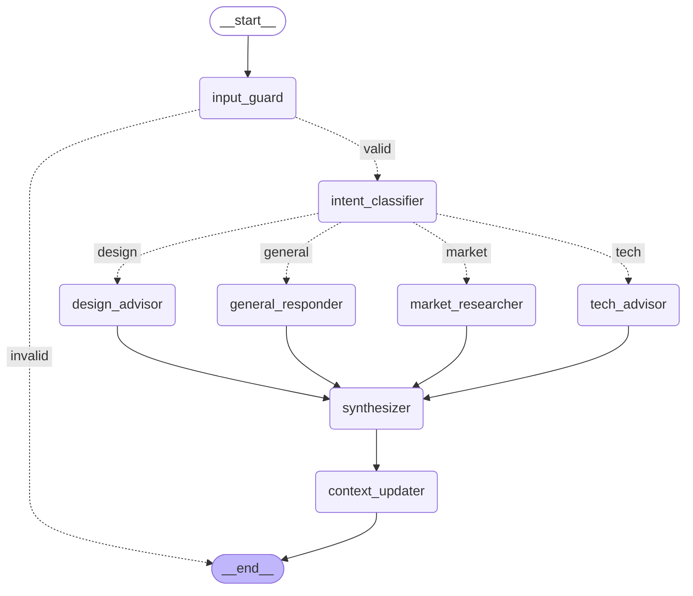
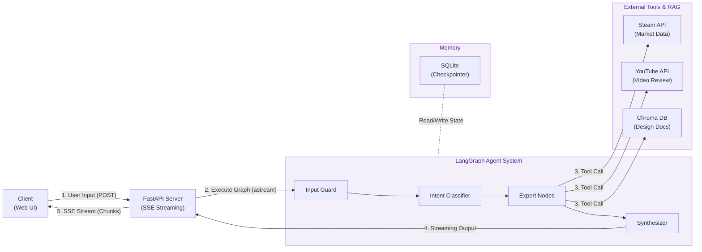
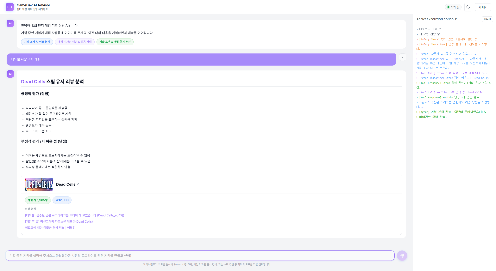
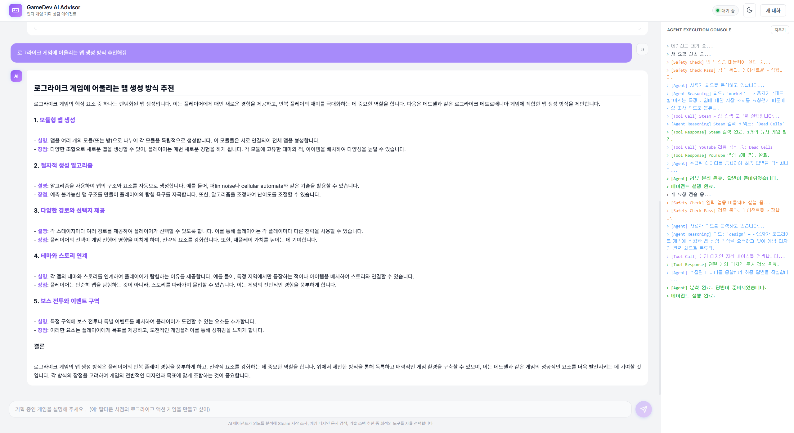
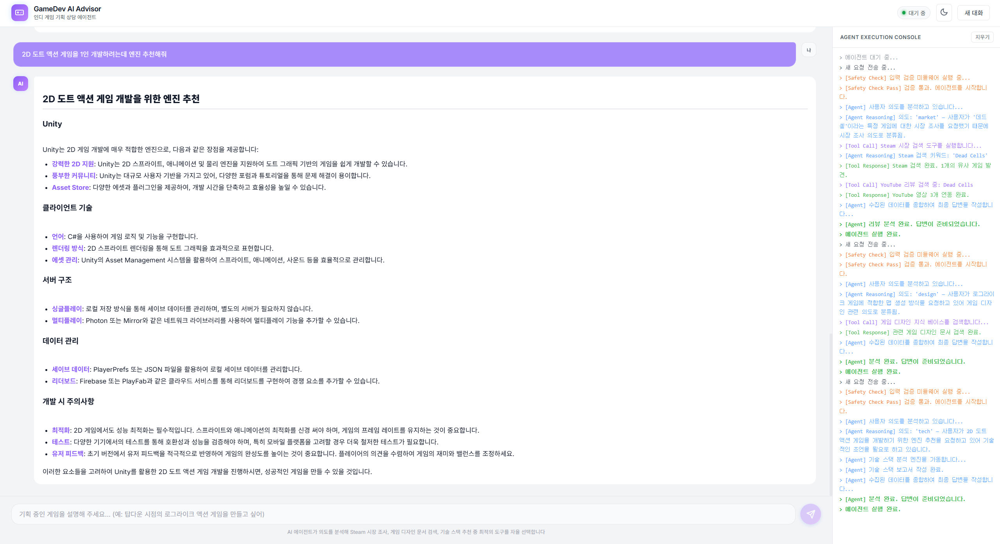

# Indie Game Advisor (인디 게임 기획 어드바이저)

인디 게임 개발자와 기획자를 위한 LangChain / LangGraph 기반 AI 챗봇 어드바이저 프로젝트입니다.

---

## 0. 문제 정의 및 기획 배경

**"인디 게임을 기획할 때, 시장의 반응과 유사 게임의 장단점을 한눈에 파악할 수는 없을까?"**

1인 개발자나 소규모 인디 팀은 기획 단계에서 시장 조사, 기술 스택 선정, 게임 디자인 패턴 등 방대한 정보 수집에 많은 시간을 할애합니다. **Indie Game Advisor**는 이러한 페인 포인트(Pain Point)를 해결하기 위해 기획되었습니다. 
단순 대답봇을 넘어, 사용자의 질문 의도를 파악하고 Steam 상점 리뷰, YouTube 영상, 검증된 디자인 문서를 스스로 검색하여 기획에 실질적으로 필요한 인사이트를 실시간으로 제공하는 것을 목표로 합니다.

---

## 1. 서비스 소개 및 사용 시나리오

### 서비스 소개
**Indie Game Advisor**는 새로운 게임을 기획하거나 아이디어를 발전시킬 때, 개발자가 필요로 하는 시장 분석, 게임 디자인, 기술 스택에 대한 조언을 실시간으로 제공하는 AI 에이전트입니다. 
LangGraph를 활용한 다중 노드 라우팅 구조를 통해 사용자의 질문 의도를 정확히 파악하고, 필요한 외부 도구(Steam API, YouTube, 로컬 RAG 문서)를 자율적으로 호출하여 기획에 즉시 적용 가능한 실무적인 정보를 제공합니다.

### 주요 사용 시나리오
1. **시장 조사 및 분석 (Market Research)**
   - **사용자**: *"하데스 시장 조사 해줘"*
   - **에이전트**: Steam API를 통해 해당 게임의 실제 유저 리뷰를 수집하고, 긍정적 평가(장점)와 부정적 평가(단점)를 요약하여 시장의 객관적인 반응을 분석해 줍니다. 추가로 우측 하단의 해당 게임의 가격과 현재 동접자수를 함께 제공하며, 해당 게임 관련 유튜브 영상 링크를 제공합니다.
2. **게임 디자인 조언 (Design Advice)**
   - **사용자**: *"로그라이크 게임에 어울리는 맵 생성 방식 추천해줘"*
   - **에이전트**: 사전에 구축된 게임 디자인 특화 RAG(Chroma DB)를 검색하여, 성공적인 인디 게임들의 디자인 패턴과 절차적 생성 로직 등에 대한 정보를 제공합니다.
3. **기술 스택 추천 (Tech Advice)**
   - **사용자**: *"2D 도트 액션 게임을 1인 개발하려는데 엔진 추천해줘"*
   - **에이전트**: 사용자의 개발 규모와 게임 장르적 특징을 분석하여, 가장 적합한 게임 엔진(Unity, Godot 등)과 개발 프레임워크를 논리적인 근거와 함께 추천해 줍니다.

---

## 2. 전체 아키텍처 설명 (다이어그램 포함)

본 프로젝트는 **LangGraph**를 활용하여 여러 에이전트 노드가 유기적으로 협력하는 구조로 설계되었습니다.

1. **`input_guard`**: 사용자의 입력이 안전한지, 비속어나 악의적인 프롬프트 인젝션이 없는지 1차적으로 검증합니다.
2. **`intent_classifier`**: 사용자의 질문 의도를 4가지(market, design, tech, general) 중 하나로 분류하고, 핵심 키워드를 추출합니다.
3. **전문가 노드 분기**:
   - `market_researcher`: Steam API를 통해 리뷰와 동접자 데이터를 수집합니다.
   - `design_advisor`: 게임 기획 관련 RAG 파이프라인(Chroma DB)을 검색합니다.
   - `tech_advisor`: 기술 스택 및 엔진 관련 조언을 제공합니다.
   - `general_responder`: 일상적인 대화나 단순 인사를 처리합니다.
4. **`synthesizer`**: 전문가 노드에서 수집된 데이터를 바탕으로 최종 응답을 종합하고 구조화(PydanticOutputParser)하여 마크다운 형태로 반환합니다.
5. **`context_updater`**: 대화 중 파악된 게임 기획 맥락(장르, 컨셉 등)을 요약하여 상태(State) 메모리에 지속적으로 누적합니다.



### 전체 시스템 데이터 흐름도 (System Architecture)



### 프로젝트 폴더 구조 (Directory Structure)

```text
Indie_game_advisor/
├── agent/              # LangGraph 기반 노드, 라우터, 상태(State) 정의
│   ├── graph.py        # StateGraph 조립 및 조건부 분기(Conditional Edge)
│   ├── nodes.py        # 전문가 노드(시장조사, 기획, 기술 등) 및 프롬프트
│   └── tools.py        # 외부 API(Steam, YouTube) 호출 도구(Tool)
├── rag/                # RAG 파이프라인 (Chroma DB 및 문서 임베딩)
├── public/             # 프론트엔드 UI (HTML, CSS, JS)
├── main.py             # FastAPI 메인 서버 및 스트리밍 엔드포인트
├── requirements.txt    # 파이썬 의존성 패키지 목록
└── README.md           # 프로젝트 문서 및 결과 보고서
```

---

## 3. 설치 및 실행 방법

1. **리포지토리 클론 및 폴더 이동**
   ```bash
   git clone https://github.com/DevKayden/Indie_game_advisor.git
   cd Indie_game_advisor
   ```
2. **의존성 패키지 설치**
   ```bash
   pip install -r requirements.txt
   ```
3. **환경 변수 설정**
   - 프로젝트 루트 디렉토리에 `.env` 파일을 생성하고 아래와 같이 API 키를 입력합니다.
   ```ini
   OPENAI_API_KEY="sk-..."
   ```
4. **서버 실행**
   - 개발 모드 (코드를 수정하면 자동으로 재시작)
   ```bash
   uvicorn main:app --reload --port 3000
   ```
   - (또는 `python main.py` 명령어로도 실행 가능합니다.)
5. **접속**
   - 브라우저를 열고 `http://localhost:3000`에 접속하여 챗봇 UI를 확인합니다.
6. **평가용 테스트 쿼리**
   - `데드셀 시장 조사 해줘` *(Market 의도 - Steam API 호출 및 리뷰 분석)*
   - `로그라이크 게임에 어울리는 맵 생성 방식 추천해줘` *(Design 의도 - 로컬 RAG 검색)*
   - `2D 도트 액션 게임을 1인 개발하려는데 엔진 추천해줘` *(Tech 의도 - 기술 스택 추천)*
   - `안녕! 넌 무슨 일을 할 수 있어?` *(General 의도 - 일반 대화 처리)*

---

## 4. 사용된 Tool / RAG / Memory / Middleware 설명

- **Tool (도구)**
  - `steam_market_search`: Steam 공식 API를 호출하여 특정 게임의 유저 리뷰 최신 20개, 현재 동접자 수, 가격, 썸네일 이미지를 실시간으로 수집합니다.
  - `youtube_review_search`: YouTube 검색 결과를 크롤링하여 대상 게임의 최신 리뷰 및 게임플레이 영상 링크 3개를 추출합니다.
- **RAG (검색 증강 생성)**
  - `game_design_rag_search`: 11개의 게임 디자인, 수익화, 장르 분석 관련 한국어 텍스트 문서를 `text-embedding-3-small`로 임베딩하여 로컬 **Chroma DB**에 구축했습니다. 기획 관련 질문이 들어오면 가장 유사한 문서를 검색해 근거 있는 답변을 제공합니다.
- **Memory (메모리 및 상태 관리)**
  - LangGraph의 `MemorySaver`를 체크포인터로 사용하여 세션(`thread_id`)별 대화 이력을 영속적으로 유지합니다.
  - `context_updater` 노드가 매 턴마다 사용자의 기획 의도를 요약하여 `game_context` 필드에 누적 저장하므로, 멀티턴 대화 내내 맥락이 끊기지 않습니다.
- **Middleware (미들웨어)**
  - **입력 검증 (Guardrail)**: `input_guard` 노드를 통해 모든 사용자 입력에 대해 비속어나 공격적인 인젝션 시도가 없는지 사전에 필터링합니다.
  - **로깅 데코레이터**: `@log_node`라는 커스텀 파이썬 데코레이터를 적용하여 각 노드의 시작/종료 시간과 소요 시간을 서버 콘솔과 클라이언트 UI(실행 콘솔 탭)에 실시간으로 로깅합니다.

## 5. 한계점 및 향후 개선 방향

- **Steam API 한계 및 의존도**: 현재 시장 조사는 전적으로 Steam API에 의존하고 있어, 모바일 전용 인디 게임이나 스팀에 등록되지 않은 게임에 대해서는 데이터를 수집할 수 없습니다. 향후 IGDB(Internet Game Database)나 Google Play Store API를 추가 연동하여 조사 범위를 확장할 수 있습니다.
- **RAG 문서 업데이트 자동화 부재**: Chroma DB에 들어간 게임 기획 문서들이 정적(Static) 파일로 구성되어 있습니다. 향후 최신 인디 게임 트렌드나 GDC(Game Developers Conference) 강연 요약본 등을 웹 크롤러가 주기적으로 긁어와서 벡터 DB를 갱신하는 파이프라인을 추가하면 품질이 크게 향상될 것입니다.
- **응답 속도 병목**: 복잡한 질문의 경우, 의도 분류 -> Steam API 호출 -> YouTube 검색 -> LLM 종합 등 여러 단계를 직렬로 거치다 보니 응답 시간이 10~15초 정도 소요됩니다. 비동기(`asyncio.gather`) 처리 범위를 늘려 외부 도구 호출을 병렬로 최적화하는 작업이 필요합니다.

---

## 6. 실행 결과 화면 (Screenshots)

### 1) 마켓 분석 및 유튜브 영상 제공 (Market Research)

- **리뷰 요약**: Steam API를 통해 수집된 실제 유저 리뷰를 바탕으로 긍정적 평가(장점)와 부정적 평가(단점)를 명확하게 나누어 제공합니다.
- **게임 정보 카드**: 해당 게임의 공식 썸네일 이미지와 함께 Steam 상점 페이지로 바로 이동할 수 있는 링크를 제공합니다.
- **실시간 통계**: 현재 동시 접속자 수와 게임 가격 정보를 뱃지 형태로 직관적으로 보여줍니다.
- **유튜브 링크**: 게임 플레이 및 리뷰를 바로 확인할 수 있는 3개의 최신 유튜브 영상 링크를 하단에 제공합니다.

### 2) 게임 디자인 RAG 검색 (Design Advice)

- **RAG 기반 답변**: 로컬 벡터 DB(Chroma)에 사전 임베딩된 검증된 게임 기획 문서를 검색하여 신뢰성 있는 조언을 제공합니다.
- **맞춤형 기획 제안**: 장르적 특성, 레벨 디자인 패턴, 수익화 모델 등 질문의 핵심 의도에 맞춘 구체적인 기획 방향성을 제시합니다.

### 3) 기술 스택 추천 (Tech Advice)

- **맞춤형 엔진 추천**: 1인 개발, 2D 도트 액션 등 사용자가 제시한 개발 환경과 장르에 가장 적합한 게임 엔진(Unity, Godot 등)을 추천합니다.
- **논리적 근거 제시**: 왜 해당 기술 스택이 최적인지, 개발 효율성과 최적화 측면에서 상세한 논리적 근거를 함께 설명합니다.

---